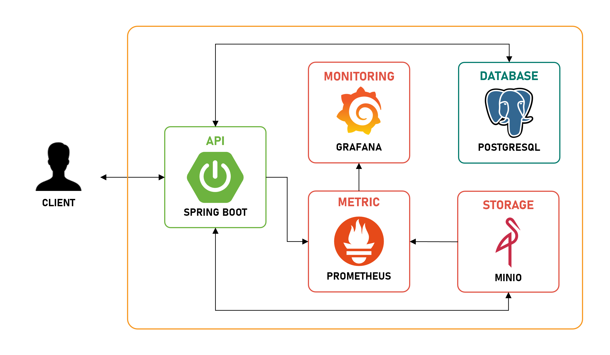

# OneBox

## 프로젝트 개요
- OneBox는 Spring Boot 기반의 클라우드 스토리지 서비스로, 계층형 폴더와 파일을 관리하면서 업로드, 다운로드, 메타데이터 관리를 제공하는 백엔드 애플리케이션입니다.
- MinIO 객체 스토리지와 PostgreSQL를 활용해 파일 데이터, 메타데이터, 동시성 처리를 구성했습니다.

## 기술 스택
- **언어 & 프레임워크:** Java 17, Spring Boot 3.5, JPA
- **DB, 스토리지:** PostgreSQL, MinIO
- **모니터링:** Prometheus, Grafana

## 프로젝트 구조
- `domain/file` : 파일 업로드/다운로드/이동/삭제 API 제공
- `domain/folder` : 폴더 생성/이동/이름변경/삭제 및 폴더 내 리소스 조회 API 제공
- `domain/metadata` : 파일/폴더 메타데이터 엔터티, DTO, 리포지토리 구성
- `global` : 예외, 응답 래퍼, AOP, 설정 등 공통 모듈

## 주요 기능
- **파일 업로드 및 다운로드**: 멀티파트와 바이너리 스트림 방식 업로드를 지원하며, MIME 타입, 파일 크기, 원본 이름을 기반으로 저장 후 다운로드 시 반환
- **파일 관리**: 파일 이동, 이름 변경, 삭제 기능 제공
- **폴더 관리**: 폴더 생성, 이동, 이름 변경, 삭제 및 특정 폴더 하위의 파일과 폴더 목록 조회 기능 제공
- **메타데이터 관리**: 폴더/파일 식별자, 경로, 크기, MIME 타입 등을 포함한 메타데이터 엔터티와 DTO를 통해 리포지토리 접근 및 정합성 관리
- **모니터링**: Spring Actuator Prometheus 엔드포인트와 MinIO 메트릭을 Prometheus로 스크랩하고 Grafana 대시보드에서 시각화

## 시스템 아키텍처
